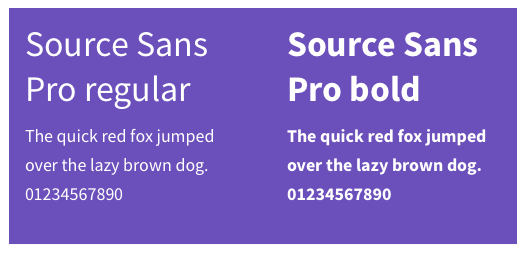
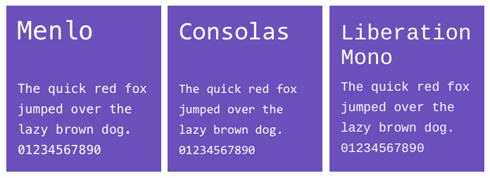
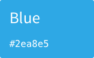
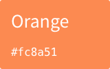
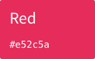
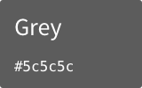
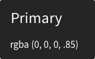
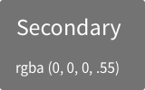

# Basics

## Contents
* [Responsive](#responsive)
* [Typography](#typography)
* [Icons](#icons)
* [Color](#color)
* [Cursors](#cursors)

---

## Responsive
GitLab is a responsive experience that works well across all screen sizes, from mobile devices to large monitors. In order to provide a great user experience, the core functionality (browsing files, creating issues, writing comments, etc.) must be available at all resolutions. However, due to size limitations, some secondary functionality may be hidden on smaller screens. Please keep this functionality limited to rare actions that aren't expected to be needed on small devices.

---

## Typography
### Primary typeface
GitLab's main typeface used throughout the UI is **Source Sans Pro**. We support both the bold and regular weight.

### Monospace typeface
This is the typeface used for code blocks and references to commits, branches, and tags (`.commit-sha` or `.ref-name`). GitLab uses the OS default font.
- **Menlo** (Mac)
- **Consolas** (Windows)
- **Liberation Mono** (Linux)

---

## Icons

GitLab has a strong, unique personality. When you look at any screen, you should know immediately know that it is GitLab. 
Iconography is a powerful visual cue to the user and is a great way for us to reflect our particular sense of style.

- **Standard size:** 16px * 16px
- **Border thickness:** 2px
- **Border radius:** 3px

> TODO: List all icons, proper usage, hover, and active states.

---

## Color

| | State | Action |
| :------: | :------- | :------- |
|  | Primary and active (such as the current tab) | Organizational, managing, and retry commands|
|  | Opened | Create new objects |
|  | Warning | Non destructive action |
|  | Closed | Delete and other destructive commands |
|  | Neutral | Neutral secondary commands |

### Text colors

|||
| :---: | :--- |
|  | Used for primary body text, such as issue description and comment |
|  | Used for secondary body text, such as username and date |

> TODO: Establish a perspective for color in terms of our personality and rationalize with Marketing usage.

---

## Cursors
The mouse cursor is key in helping users understand how to interact with elements on the screen.

| | |
| :------: | :------- |
|  | Default cursor |
|  | Pointer cursor: used to indicate that you can click on an element to invoke a command or navigate, such as links and buttons |
|  | Move cursor: used to indicate that you can move an element around on the screen |
|  | Pan cursor (opened): indicates that you can grab and move the entire canvas, affecting what is seen in the view port. |
|  | Pan cursor (closed): indicates that you are actively panning the canvas. |
|  | I-beam cursor: indicates that this is either text that you can select and copy, or a text field that you can click into to enter text. |

