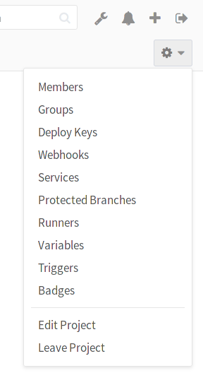
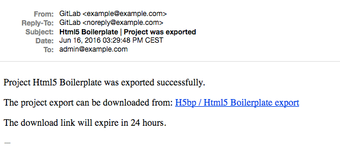

# Project import/export

>**Notes:**
>
>  - [Introduced][ce-3050] in GitLab 8.9.
>  - Importing will not be possible if the import instance version differs from
>    that of the exporter.
>  - For existing installations, the project import option has to be enabled in
>    application settings (`/admin/application_settings`) under 'Import sources'.
>    Ask your administrator if you don't see the **GitLab export** button when
>    creating a new project.
>  - You can find some useful raketasks if you are an administrator in the
>    [import_export](../../../administration/raketasks/project_import_export.md)
>    raketask.
>  - The exports are stored in a temporary [shared directory][tmp] and are deleted
>    every 24 hours by a specific worker.
>  - Group members will get exported as project members, as long as the user has
>    master or admin access to the group where the exported project lives. An admin
>    in the import side is required to map the users, based on email or username.
>    Otherwise, a supplementary comment is left to mention the original author and
>    the MRs, notes or issues will be owned by the importer.

Existing projects running on any GitLab instance or GitLab.com can be exported
with all their related data and be moved into a new GitLab instance.

## Version history

| GitLab version | Import/Export version |
| -------- | -------- |
| 8.17.0 to current  | 0.1.6    |
| 8.13.0   | 0.1.5    |
| 8.12.0   | 0.1.4    |
| 8.10.3   | 0.1.3    |
| 8.10.0   | 0.1.2    |
| 8.9.5    | 0.1.1    |
| 8.9.0    | 0.1.0    |

 > The table reflects what GitLab version we updated the Import/Export version at.
 > For instance, 8.10.3 and 8.11 will have the same Import/Export version (0.1.3)
 > and the exports between them will be compatible.

## Exported contents

The following items will be exported:

- Project and wiki repositories
- Project uploads
- Project configuration including web hooks and services
- Issues with comments, merge requests with diffs and comments, labels, milestones, snippets,
  and other project entities

The following items will NOT be exported:

- Build traces and artifacts
- LFS objects
- Container registry images
- CI variables
- Any encrypted tokens

## Exporting a project and its data

1. Go to the project settings page by clicking on **Edit Project**:

    

1. Scroll down to find the **Export project** button:

    

1. Once the export is generated, you should receive an e-mail with a link to
   download the file:

    

1. Alternatively, you can come back to the project settings and download the
   file from there, or generate a new export. Once the file available, the page
   should show the **Download export** button:

    

## Importing the project

1. The new GitLab project import feature is at the far right of the import
   options when creating a New Project. Make sure you are in the right namespace
   and you have entered a project name. Click on **GitLab export**:

    

1. You can see where the project will be imported to. You can now select file
   exported previously:

    

1. Click on **Import project** to begin importing. Your newly imported project
   page will appear soon.

[ce-3050]: https://gitlab.com/gitlab-org/gitlab-ce/issues/3050
[tmp]: ../../../development/shared_files.md
